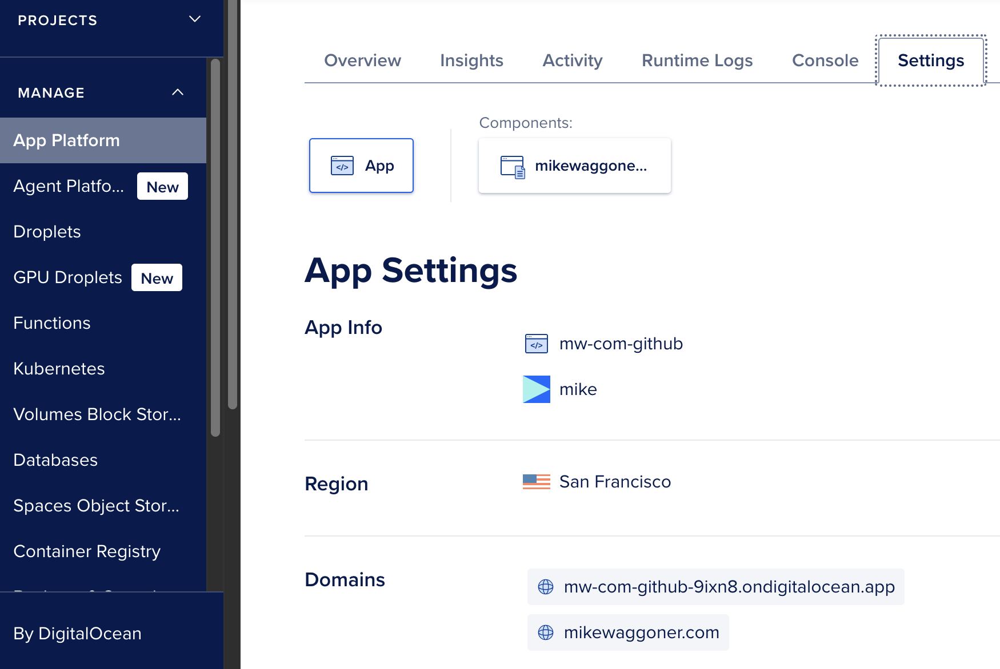
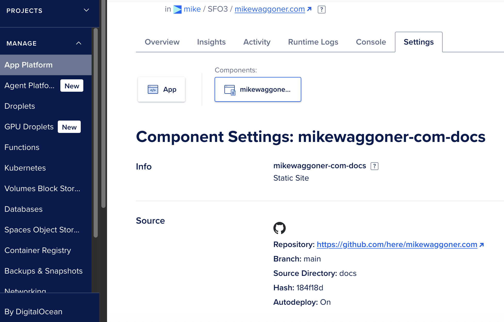

## mikewaggoner.com

This repo updates [mikewaggoner.com](https://mikewaggoner.com)

 - 2025 - Static site on [DigitalOcean - App Platform](https://docs.digitalocean.com/products/app-platform/)
 - 2024 - Static site on [Glitch](https://en.wikipedia.org/wiki/Glitch,_Inc.) with a Fastly CDN
 - Previously - Redirect to [herebox.org](https://herebox.org) personal site

### Digital Ocean config notes

Digital Ocean tutorial at [How To Deploy a Static Website to the Cloud with DigitalOcean App Platform](https://www.digitalocean.com/community/tutorials/how-to-deploy-a-static-website-to-the-cloud-with-digitalocean-app-platform)

For custom domains via CNAME records, add the custom domain must be added to App Platform -> Settings -> Domains .

DigitalOcean -> App Platform -> Settings:

DigitalOcean App Platform -> Settings -> Component:
